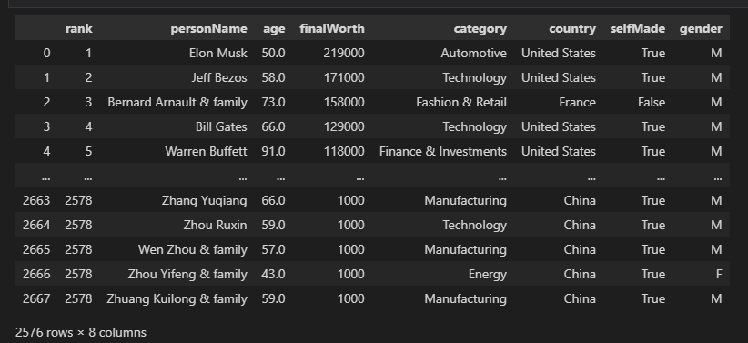
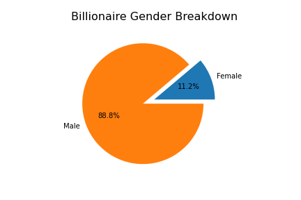
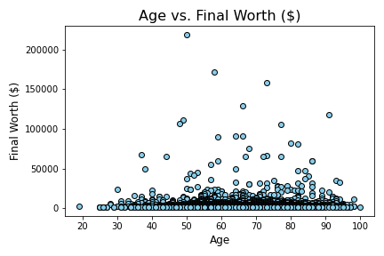
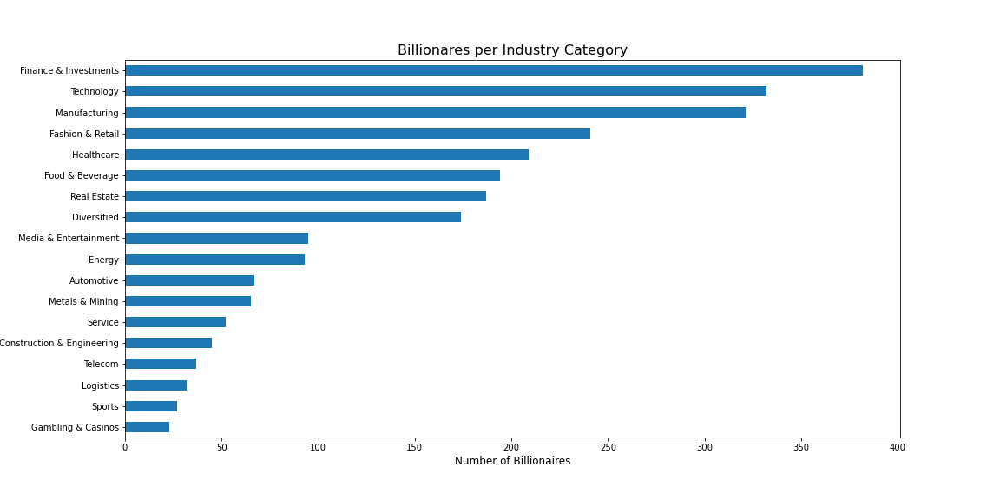

# Billionaire Analysis

---

**File Sources:**

- Jupyter Notebook: [cleaning_data.ipynb](cleaning_data.ipynb)
- CSV: [forbes_2022_billionaires.csv](Resources/forbes_2022_billionaires.csv)
- Cleaned CSV: [cleaned_billionaire.csv](Resources/cleaned_billionaire.csv)

**Technologies Used:**

- Python: Coding language. Packages include: Pathlib, Pandas, Matplotlib (including PyPlot), Plotly, Scikitlearn (including LabelEncoder, StandardScaler, train_test_split, confusion_matrix, accuracy_score, classification_report), Numpy
- SQL: Database host
- Tableau: Visualization creation
- HTML: Dashboard creation using Javascript/ CSS for customization
- Jupyter Notebook: Code production and testing purposes
- Quick Database Diagrams: To draft the entity relationship diagram

---

## Topic Introduction:

We will be analyzing trends seen in the billionaire community throughout this project. Specifically, we are looking to predict the net worth of a specific billionaire subject dependent on input variables including age, source of wealth and country. We plan to inspect two data frames from different periods in time (2018 and 2022) to understand changes over time as seen in subjects who hold billionaire status.

## Purpose:

We chose this topic as all team members had an interest in analyzing data relevant to finance. When compared to other financial topics, such as car price prediction and stock price prediction, the billionaire data sparked more interest as it represents a way to inspect economies over time and over world locations.

Analyzing the demographic information of billionaires can provide insight into the thriving industries, the accumulation of wealth, and the prevalent traits of billionaires such as age, gender, and location. Examining the yearly changes in billionaire data can give us a comprehensive understanding of growth patterns in emerging sectors.

Our team will be interested to compare the number of billionaires in each industry, examine the gender ratio, and discover other demographic trends that present themselves between the data from 2018 and 2022.

## Analysis Overview:

The purpose of this analysis was to clean the raw csv file containing information on Forbes Billionaires of 2022. The future use case of the cleaned billionaire csv file will be used for machine learning to better understand the relationships between key features and billionaires around the globe.

## Data Insights:

- This project includes two separate sets of data: one captures data on billionaires in 2018, and the second dataset is of billionaires from 2022.

- Both datasets are from Forbes.com. Forbes is a global media company that is focused on covering subjects regarding business, investing, technology, entrepreneurship, and lifestyle.

- The original Forbes Billionaire datasets had 23 separate columns ranging from each billionaire’s biography, their net worth, to the number of siblings they have.

- Based on the timeframe of this project, it was determined to build a supervised learning model; therefore, the data was encoded to numerical values in order for the machine learning model to produce a numerical outcome.

- Also based on the scope and goal of the project the data was cleaned and reduced to 7 specific columns.

- It was determined that the necessary columns included net worth, age, category, country, gender, and overall wealth rank.

- Each billionaire's name became the project's primary unique value.

- Machine learning algorithms typically only work with numerical data; therefore, things like the billionaire's country, the sector they made their wealth, and their gender were encoded to numerical values.

- Overall the data was cleaned and prepared in a way so the machine learning model could produce an outcome that can accuratley predict if an net worth is greater than a specified value.

## Questions To Answer:

- Will a model be able to predict if a billionaire's final worth is greater than $4.799 billion (the mean net worth value on the list) based off feature input values?
- What industries are 2022 billionaires in?
- Do the average ages of billionaires vary across different countries?
- Which industries produced billionaires in specific age groups and demographics?
- What is the percentage of male to female billionaires?
- Which countries are home to billionaires? Also, how many billionaires live in each country?
- Are a majority of billionaires male and over 50 years old?

When comparing 2018 to 2022 data...

- How has the distribution of industries that billionaires operate in changed from 2018 to 2022?
- What has been the shift in the distribution of billionaires' net worths from 2018 to 2022?
- What has been the change in the number of billionaires per country from 2018 to 2022?
- What is the comparison of male to female billionaires from 2018 to 2022?
- What has been the shift in the age groups of billionaires from 2018 to 2022?

---

## Results:

#### Cleaning Data

- Using Jupyter Notebook and Pandas to clean the data, the file was first imported using the pathlib function and put into a dataframe using pandas.

- In order to not over complicate and overfit our future machine learning process, certain columns that do not add value are dropped from the original dataframe.

- All of the data types are checked to ensure they are correct, which they are.

- The columns are counted and null values are checked to ensure all rows are filled. Any null values are dropped from the set and duplicate values are non-existent.

- The end result is the following image of the new and improved data set for further analysis.

#### Exploratory Data Analysis

- Using Jupyter Notebook and Pandas the cleaned dataset for 2022 was filtered down to see the relationship between the number of billionaires and gender specifics. Below shows a pie chart highlighting the gender split between Male and Female. Male made up 88.8% of billionaires while Female only made up 11.2%.

- To determine how age effects a billionaires final net worth, the following scatter plot was created. From this simple analysis, we can see that there isn't a huge correlation or relationship, so far between age and a billionaires final net worth.

- Taking a close look at the Industry Category and the number of billionaires we can see from the horizontal bar chart below which industries rank the highest. **#1 Finance & Investments, #2 Technology, and #3 Manufacturing**.

#### Machine Learning Model

**Section 1:** The cleaned data was read into a dataframe for the 2022 Forbes List. A column was added to the dataframe that captured billionaires with final worth > 4799. If their final worth was greater than 4799, a 1 is generated into the column and a 0 if their final worth is less than 4799.
Target features are "rank", "age", "category", "country", "gender_F", and "gender_M" with the target column "finalWorth>4799".
Training and testing the model under logistic regression, the model was able to produce results of 99% accuracy.

**Section 2:** This model takes the cleaned merge data from 2018 and 2022 and ran through another logistical regression model. Using the same framework as section 1, a new column was generated to identify billionaires with a networth over 4799. While this model generated a slightly low accuracy, the model is still very accurate with a result of 96.7%.

**Section 3:** After further analysis of section 1 and 2 models, we wanted to see how much weight the "rank" column had on the machine learning model. The "rank" column was removed and the 2022 model from section 1 was ran through the logistical regression model to see how the results differ from the section 1 results. The accuracy of the model was significally impacted by the "rank" column resulting in a lower accuracy score of 75.4% versus with the "rank" column 99%.

---

## Summary:

After cleaning the data set we can now see that our number of billionaires for 2022 are filtered down to 2,576 people with 8 important features. All of the information is relative to future analysis in understanding the relationships between these individuals around the world.
