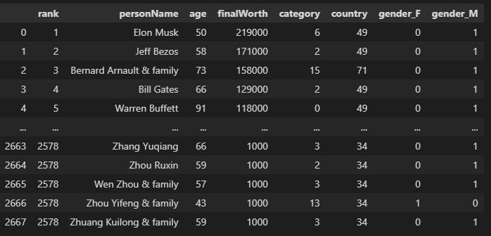

# Billionaire Analysis

**File Sources:**

- Jupyter Notebook: [cleaning_data.ipynb](cleaning_data.ipynb)
- CSV: [forbes_2022_billionaires.csv](Resources/forbes_2022_billionaires.csv)
- Cleaned CSV: [cleaned_billionaire.csv](Resources/cleaned_billionaire.csv)

---

## Analysis Overview:

The purpose of this analysis was to clean the raw csv file containing information on Forbes Billionaires of 2022. The future use case of the cleaned billionaire csv file will be used for machine learning to better understand the relationships between key features and billionaires around the globe.

---

## Results:

- Using Jupyter Notebook and pandas to clean the data, the file was first imported using the pathlib function and put into a dataframe using pandas.

- In order to not over complicate and overfit our future machine learning process, certain columns that do not add value are dropped from the original dataframe.

- All of the data types are checked to ensure they are correct, which they are.

- The columns are counted and null values are checked to ensure all rows are filled. Any null values are dropped from the set and duplicate values are non-existent.

- The end result is the following image of the new and improved data set for further analysis.

---

## Summary:

After cleaning the data set we can now see that our number of billionaires for 2022 are filtered down to 2,576 people with 8 important features. All of the information is relative to future analysis in understanding the relationships between these individuals around the world.

The questions we want to answer are, what industries make up majority of billionaires? At what age is someone most likely to be a billionaire? Are they usually male or female? What country are they from and is there money inhereted or are they self made?

These questions will be answered in our future analysis.

---

## Technologies Used:

- Python: Coding language. Packages include: Pathlib, Pandas, Matplotlib (including PyPlot), Plotly, Scikitlearn (including LabelEncoder, StandardScaler, train_test_split, confusion_matrix, accuracy_score, classification_report), Numpy 
- SQL: Database host
- Tableau: Visualization creation
- HTML: Dashboard creation using Javascript/ CSS for customization
- Jupyter Notebook: Code production and testing purposes
- Quick Database Diagrams: To draft the entity relationship diagram

## Data

- This project includes two separate sets of data: one captures data on billionaires in 2018, and the second dataset is of billionaires from 2022.

- Both datasets are from Forbes.com. Forbes is a global media company that is focused on covering subjects regarding business, investing, technology, entrepreneurship, and lifestyle.

- The original Forbes Billionaire datasets had 23 separate columns ranging from each billionaire’s biography, their net worth, to the number of siblings they have.

- Based on the timeframe of this project, it was determined to build a supervised learning model; therefore, the data was encoded to numerical values in order for the machine learning model to produce a numerical outcome.

- Also based on the scope and goal of the project the data was cleaned and reduced to 7 specific columns.

- It was determined that the necessary columns included net worth, age, category, country, gender, and overall wealth rank. 

- Each billionaire's name became the project's primary unique value. 

- Machine learning algorithms typically only work with numerical data; therefore, things like the billionaire's country, the sector they made their wealth, and their gender were encoded to numerical values.

- Overall the data was cleaned and prepared in a way to predict net worth based on the included columns in the cleaned datasets.
