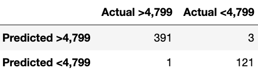
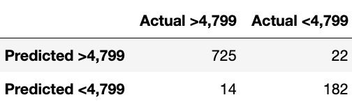
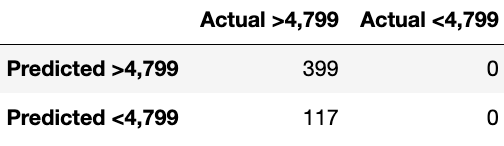
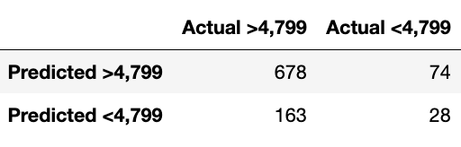

# Billionaire Analysis

---

**File Sources:**

- Original Forbes 2022 Billionaire List Data: [forbes_2022_billionaires.csv](Resources/forbes_2022_billionaires.csv)
- Cleaning Process with Python for 2022 Data: [cleaning_data.ipynb](cleaning_data.ipynb)
- Cleaned Forbes 2022 Billionaire List Data: [cleaned_billionaire.csv](Resources/cleaned_billionaire.csv)
- Original Forbes 2018 Billionaire List Data: [forbes_2018_billionaires.csv](Resources/forbes_2018_billionaires.csv)
- Cleaning Process with Python for 2018 Data: [cleaning_data_2018.ipynb](cleaning_data_2018.ipynb)
- Cleaned Forbes 2018 Billionaire List Data: [cleaned_2018_billionaire.csv](Resources/cleaned_2018_billionaire.csv)

**Technologies Used:**

- Python: Coding language. Packages include: Pathlib, Pandas, Matplotlib (including PyPlot), Plotly, Scikitlearn (including LabelEncoder, StandardScaler, train_test_split, LogisticRegression, RandomForestClassifier, confusion_matrix, accuracy_score, classification_report), Numpy, and SQLAlchemy
- SQL: Database host
- Tableau: Visualization creation
- HTML: Dashboard creation using Javascript/ CSS for customization
- Jupyter Notebook: Code production and testing purposes
- Quick Database Diagrams: To draft the entity relationship diagram

---

## Topic Introduction:

We will be analyzing trends seen in the billionaire community throughout this project. Specifically, we are looking to predict the net worth of a specific billionaire subject dependent on input variables including age, source of wealth and country. We plan to inspect two data frames from different periods in time (2018 and 2022) to understand changes over time as seen in subjects who hold billionaire status.

## Purpose:

We chose this topic as all team members had an interest in analyzing data relevant to finance. When compared to other financial topics, such as car price prediction and stock price prediction, the billionaire data sparked more interest as it represents a way to inspect economies over time and over world locations.

Analyzing the demographic information of billionaires can provide insight into which industries are thriving, the accumulation of wealth, and the prevalent traits of billionaires such as age, gender, and location.

Our team will be interested to compare the number of billionaires in each industry, examine the gender ratio, and discover other demographic trends that present themselves between the data from 2018 and 2022.

## Analysis Overview:

The purpose of this analysis was to clean the raw csv file containing information on Forbes Billionaires of 2022. The future use case of the cleaned billionaire csv file will be used for machine learning to better understand the relationships between key features and billionaires around the globe.

## Selected Topic: "The Forbes World’s Billionaires list"

Forbes is an American based business magazine and media company that produces articles that shed light on finance, industry, investing, and marketing related topics. The Forbes website reaches more than 27 million unique visitors each month. One of the main attractions to the website is the Forbes World’s Billionaires list. The Forbes Billionaire list is an actively managed snapshot of individual and family wealth in today's global economy. Currently, there are, “2,668 billionaires on Forbes’ 36th-annual ranking of the planet’s richest people—87 fewer than a year ago. They’re worth a collective $12.7 trillion—$400 billion less than in 2021.” One of the primary methods that Forbes uses to track net worth is through stock prices and exchange rates. Due to the volatility of the market billionaires can be made or lost through day to day trading and general market price fluctuations. Some billionaires on the list do provide their private financial statements to Forbes, but in general Forbes has to predict and discount the variety of assets that are private companies, real estate, and art.

## Data Insights:

- This project includes two separate sets of data: one captures data on billionaires in 2018, and the second dataset is of billionaires from 2022.

- Both datasets are from Forbes.com. Forbes is a global media company that is focused on covering subjects regarding business, investing, technology, entrepreneurship, and lifestyle.

- The original Forbes Billionaire datasets had 23 separate columns ranging from each billionaire’s biography, their net worth, to the number of siblings they have.

- Based on the timeframe of this project, it was determined to build a supervised learning model; therefore, the data was encoded to numerical values in order for the machine learning model to produce a numerical outcome.

- Also based on the scope and goal of the project the data was cleaned and reduced to 7 specific columns.

- It was determined that the necessary columns included net worth, age, category, country, gender, and overall wealth rank.

- Each billionaire's name became the project's primary unique value.

- Machine learning algorithms typically only work with numerical data; therefore, things like the billionaire's country, the sector they made their wealth, and their gender were encoded to numerical values.

- Overall the data was cleaned and prepared in a way so the machine learning model could produce an outcome that can accuratley predict if an net worth is greater than a specified value.

## Data Columns Explained:

- The first column is the person’s name which acts as the unique identifier and primary key.

- The age column represents how old each billionaire is.

- The net worth of each billionaire is found in the billionaire final worth column.

- The industry that the billionaire derives the majority of their wealth from is captured in the category column.

- The country column illustrates each billionaire’s current citizenship.

- The gender columns split the billionaires into male or female categories.

## Questions To Answer:

We are interested in discovering who 2022 billionaires are. Since there was such a large shift in the total wealth owned by billionaires (loss of $400 billion compared to 2021 billionaires), there are several insights that can be uncovered when examining trends in billionaire demographics.

We will examine the following questions:

- Will a model be able to predict if a billionaire's final worth is greater than $4.799 billion (the mean net worth value on the list) based off feature input values? Will it be able to predict more accurately if 2018 list is included?
- Do the average ages of billionaires vary across different countries? Do ages vary from the 2018 to 2022 lists?
- Which industries produced billionaires in specific age groups and demographics? Do these industries vary from the 2018 to 2022 lists?
- Which countries are home to billionaires? Also, how many billionaires live in each country? How do these totals change from the 2018 to 2022 lists?

---

## Results:

#### Cleaning Data

- Using Jupyter Notebook and Pandas to clean the data, the file was first imported using the pathlib function and put into a dataframe using pandas.

- In order to not over complicate and overfit our future machine learning process, certain columns that do not add value are dropped from the original dataframe.

- All of the data types are checked to ensure they are correct, which they are.

- The columns are counted and null values are checked to ensure all rows are filled. Any null values are dropped from the set and duplicate values are non-existent.

- The end result is the following image of the new and improved data set for further analysis.

#### Exploratory Data Analysis

- Exploratory Data Analysis: [billionaire_exploratory_analysis.ipynb](/billionaire_exploratory_analysis.ipynb)

- Using Jupyter Notebook and Pandas the cleaned dataset for 2022 was filtered down to see the relationship between the number of billionaires and gender specifics. Below shows a pie chart highlighting the gender split between Male and Female. Male made up 88.8% of billionaires while Female only made up 11.2%.

- To determine how age effects a billionaires final net worth, the following scatter plot was created. From this simple analysis, we can see that there isn't a huge correlation or relationship, so far between age and a billionaires final net worth.

- Taking a close look at the Industry Category and the number of billionaires we can see from the horizontal bar chart below which industries rank the highest. **#1 Finance & Investments, #2 Technology, and #3 Manufacturing**.

---

#### Machine Learning Model

Applying a supervised machine learning model to the dataset can reveal if hidden trends in the data can lead to accurate predictions. In this model, we will predict whether or not a billionaire has a final worth greater than the 2022 mean final worth value of $4.799 billion.

- Machine learning model: [machine_learning_model.ipynb](/machine_learning_model.ipynb)

Note: In this file the code is read in through the associated csv files. Code to connect to a SQL database is provided in the second cell.

We completed 6 model instances with the following parameters:

#### Model Run 1:

The cleaned data was read into a dataframe for the 2022 Forbes List. A column was added to the dataframe that captured billionaires with final worth > $4.799 billion. If their final worth was greater than $4.799 billion, a 1 is generated into the column and a 0 if their final worth is less than $4.799 billion.

Target features are "rank", "age", "category", "country", "gender_F", and "gender_M" with the target column "finalWorth>4799".
Training and testing the model under logistic regression, the model was able to produce results of 99.22% accuracy.

The confusion matrix presents the prediction values.

#### Model Run 2:

This model takes the cleaned merge data from 2018 and 2022 and ran through another logistical regression model. Using the same framework as section 1, a new column was generated to identify billionaires with a networth over $4.799 billion.

While this model generated a slightly lower accuracy, the model is still very accurate with a result of 96.18%.

The confusion matrix presents the prediction values.

#### Model Run 3:

After further analysis of section 1 and 2 models, we wanted to see how much weight the "rank" column had on the machine learning model. The "rank" column was removed and the 2022 data from section 1 was ran through the logistical regression model to see how the results differ from the section 1 results.

The accuracy of the model was significally impacted by the "rank" column resulting in a lower accuracy score of 77.32% versus with the "rank" column 99.22%.

The confusion matrix presents the prediction values. Note that there are 0 values in the true positive and false positive cells. This means no values were predicted to have final worth > $4.799 and turned out to actually have final worth < $4.799, and no values were predicted final worth < $4.799 and turned out to have final worth > $4.799. This could suggest that the model is guessing conservatively, or the model is generalizing too heavily based on the limited data provided. If we were able to access more data, the generalization problem could be corrected through extra training.

#### Model Run 4:

We then tested the 2018 and 2022 merged data with the revised feature list to see if the accuracy remains level with the model in section 3.

After running through the logistical regression model, the accuracy score came to be slightly more at 77.94%

The confusion matrix presents the prediction values. Note that there are 0 values in the true positive and false positive cells. This means no values were predicted to have final worth > $4.799 and turned out to actually have final worth < $4.799, and no values were predicted final worth < $4.799 and turned out to have final worth > $4.799. This could suggest that the model is guessing conservatively, or the model is generalizing too heavily based on the limited data provided. If we were able to access more data, the generalization problem could be corrected through extra training.

#### Model Run 5:

After viewing the success of the LogisticRegression model, we decided to use the RandomForestClassifier ensemble model to rank the importance of the features. This will give us a full list of the features as well as scores to measure how critical they are in calculating whether a billionaire's final worth is greater than $4.799 billion.
After applying this model to the 2022 dataset, the accuracy score came to be slightly less at 76.94%. 

The feature importances were ranked in this order: "age", "country", "category", "gender_F", "gender_M". This suggests age is significantly more important to predicting final worth than the other features.\*

The confusion matrix presents the prediction values.

#### Model Run 6:

We applied the RandomForestClassifier ensemble model to the 2018 and 2022 merged data to see if the feature importance rankings would hold steady with additional data.

The accuracy of this model came to be less than all of the previous models at 71.70%. 

The feature importances were ranked in this order: "age", "country", "category", "gender_F", "gender_M". This suggests age is significantly more important to predicting final worth than the other features. We can also observe that "country" and "category" have more distance between them in the 2018 and 2022 merged data, suggesting "country" may have experienced some changes that occurred between the 2018 and 2022 lists.\*

The confusion matrix presents the prediction values.

 \* A note about features: "The feature importance scores returned by a random forest classifier are typically normalized so that they add up to 1.0, with higher scores indicating more important features. The values are not necessarily proportional to the percentage of the overall prediction that each feature contributes, and they are not bounded by 0 and 100.
In general, it’s more important to focus on the relative importance of each feature, rather than the absolute magnitude of the scores. For example, if a feature has an importance score of 0.2 and another feature has a score of 0.1, it means that the first feature is twice as important as the second feature in the prediction model." 

---
## Tableau Dashboard
View our analysis and visualizations for the Forbes Billionaires List data on our [Tableau Public Dashboard](https://public.tableau.com/views/billionairedata/Story1?:language=en-US&publish=yes&:display_count=n&:origin=viz_share_link).

---

## Answering Our Questions:

We examined who billionaires are throughout the data exploration, analysis, machine learning model prediction, and visualization process. After consideration of our data, we are able to answer our original questions with evidence from the 2018 and 2022 Forbes Billionaires Lists.

- Will a model be able to predict if a billionaire's final worth is greater than $4.799 billion (the mean net worth value on the list) based off feature input values? Will it be able to predict more accurately if 2018 list is included?

  - A logistic regression model can predict if a billionaire's final worth is greater than $4.799 billion with moderate accuracy.
  - The results were similar for the lone 2022 data and the 2018/ 2022 merged data. The merged 2018/ 2022 data was slightly less accurate than the lone 2022 data.

- Do the average ages of billionaires vary across different countries? Do ages vary from the 2018 to 2022 lists?

  - Yes, there are differences in the average age of billionaires across countries. However, the bulk of the average age range across countries falls between 55 and 75 with a few outliers below 55 and above 75. 
  - There doesn't seem to be any significant difference between the 2018 and 2022 datasets.

- Which industries produced billionaires in specific age groups and demographics? Do these industries vary from the 2018 to 2022 lists?

  - In 2022, Technology produced almost half of the wealth seen in billionaires for those 49 and under. We see a major shift with the 50 to 59 demographic, where Technology continued to produce the most wealth for billionaires, but the percentage shrinks to about 25%. The 60 to 69 demographic sees the majority of billionaire wealth produced by the Finance & Investments industry. The Fashion & Retail industry produced the majority of billionaire wealth for the 70 to 79 and 80 to 89 demographics. Lastly, the Finance & Investments industry produced the majority of billionaire wealth for ages 90 and up.

  - There are two major differences seen in 2018. The industry that produced most billionaires for groups 59 and under, as well as the 80 to 89 group, and 90 and up group follow similar trends as seen in 2022. However, we see some shifts in the 60 to 69 age demographic, with this demographic seeing the most wealth being created by the Fashion & Retail Industry. For the 70 to 79 demographic, there is a tie between Fashion & Retail and Finance & Investments creating the most wealth. 

- Which countries are home to billionaires? Also, how many billionaires live in each country? How do these totals change from the 2018 to 2022 lists?

---

## Summary:

After cleaning the data set we can now see that our number of billionaires for 2022 are filtered down to 2,576 people with 7 important features. All of the information is relative to future analysis in understanding the relationships between these individuals around the world.

We examined who billionaires are throughout the data exploration, analysis, machine learning model prediction, and visualization process. After consideration of our data, we are able to answer our original questions with evidence from the 2018 and 2022 Forbes Billionaires Lists.
